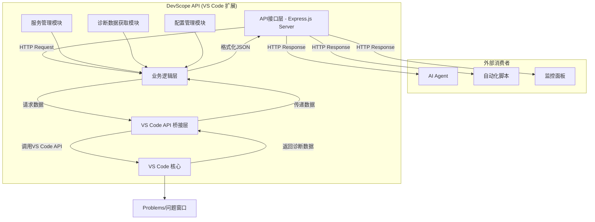

好的，遵从您的指令。作为AI软件架构专家，我将为您即将开发的这款VS Code扩展程序，提供一份完整、可执行的产品架构与开发路线图（PRD）。

---

# 《DevScope API: VS Code诊断服务》AI自动开发架构方案

---

## 1. 【产品功能分析】

### 1.1 核心价值定位
**产品愿景**: 将VS Code从一个封闭的IDE转变为一个可编程的开发数据中心，允许外部AI Agent和自动化工具实时访问代码质量信息。
**目标用户**: 
- **AI Agent开发者**: 需要让AI Agent感知当前代码库的健康状况。
- **DevOps工程师**: 希望将本地IDE的实时诊断集成到自动化流程中。
- **软件架构师/技术经理**: 试图构建自定义的代码质量监控面板。
**核心价值**: 解决自动化系统与IDE之间的信息孤岛问题，提供一个标准、实时、低侵入性的方式来程序化地获取代码诊断信息。

### 1.2 功能架构图


### 1.3 核心功能列表
| 功能模块 | 功能描述 | 优先级 | 复杂度 |
|---------|------------------------------------------------------------------------------------------------|--------|--------|
| **核心API服务** | 扩展激活后，在后台启动一个HTTP服务器，并提供一个核心API端点 (`/diagnostics`) 用于获取所有代码诊断问题。 | **高** | **中等** |
| **状态栏与命令** | 在VS Code状态栏显示服务运行状态（如运行中/已停止），并提供命令面板 (`Ctrl+Shift+P`) 来手动启动/停止服务。 | **高** | **简单** |
| **可配置化设置** | 允许用户在VS Code的设置 (`settings.json`) 中自定义服务的端口号、主机地址以及API返回的数据格式。 | **中** | **简单** |

---

## 2. 【技术架构设计】

### 2.1 技术选型
| 技术层级 | 推荐方案 | 备选方案 | 选择理由 |
|---------|---------|---------|---------|
| **核心语言** | **TypeScript** | JavaScript | TypeScript提供静态类型检查，对于开发需要长期维护的、结构清晰的API服务至关重要，能显著减少运行时错误，便于AI Agent理解代码结构。 |
| **HTTP服务器** | **Express.js** | Node.js原生`http`模块 | Express.js是轻量级且极其成熟的框架，封装了路由、中间件等复杂性，开发效率远高于原生模块。对于构建结构清晰的API服务是最佳选择。 |
| **打包与部署** | **vsce (VS Code Extension Manager)** | 手动打包`.vsix` | `vsce`是官方的命令行工具，可以自动化完成打包、发布到VS Code Marketplace的整个流程，是实现自动化部署的基础。 |

### 2.2 项目结构
```
devscope-api/
├── .vscode/               # VS Code开发环境配置
├── src/                   # 源码目录
│   ├── extension.ts       # 扩展激活/停用入口，命令注册
│   ├── server.ts          # Express服务器的配置、启动和停止逻辑
│   ├── api/               # API路由和控制器
│   │   └── diagnosticsController.ts # 处理/diagnostics请求的逻辑
│   ├── providers/         # 数据提供层
│   │   └── diagnosticsProvider.ts # 封装从VS Code API获取和格式化诊断信息的逻辑
│   └── common/            # 通用类型和接口定义
│       └── types.ts       # TypeScript类型定义
├── package.json           # 项目依赖和扩展清单
├── tsconfig.json          # TypeScript编译配置
├── .eslintrc.js           # ESLint配置
└── README.md              # 项目文档
```

---

## 3. 【分阶段开发路线图】

### 【第一阶段：MVP核心验证】(1-2周)

**目标**: 验证将VS Code诊断信息通过HTTP API暴露出来的核心技术通路，构建一个可工作的最小原型。
**开发策略**: 快速实现，功能写死，忽略优雅的错误处理和配置，专注打通端到端流程。

**核心功能**:
- **功能1 (服务启动)**: 扩展激活时，在固定端口（如3000）启动一个Express服务器。
- **功能2 (核心API)**: 实现一个GET端点 `/diagnostics`，调用时获取当前工作区所有诊断信息，并以原始JSON格式返回。
- **功能3 (手动命令)**: 在命令面板中添加一个 "DevScope: Start Server" 命令来触发服务启动。

**技术实现**:
- **后端 (扩展)**: 使用TypeScript和Express.js。所有逻辑可以先写在`extension.ts`中，无需复杂的文件结构。
- **数据**: 直接调用 `vscode.languages.getDiagnostics()`，不进行任何数据转换。

**成功标准**:
- [ ] 扩展加载后，可以通过命令成功启动HTTP服务器。
- [ ] 在浏览器或`curl`中访问 `http://localhost:3000/diagnostics` 能返回一个包含诊断信息的JSON数组。
- [ ] 返回的数据与VS Code“问题”窗口中的内容基本一致。

**交付物**:
- 可在开发模式下运行的VS Code扩展程序。
- 核心功能的源代码。
- 一份简单的README，说明如何启动和测试。

---

### 【第二阶段：产品化完善】(2-4周)

**目标**: 将原型变成一个稳定、可用、对用户友好的工具，并建立良好的代码架构。
**开发策略**: 重构MVP代码，引入配置项，完善用户交互，增加健壮性。

**新增功能**:
- **功能4 (状态栏UI)**: 在VS Code底部状态栏增加一个图标，显示API服务的运行状态（例如：[API 🟢 Running]，[API 🔴 Stopped]），点击可切换状态。
- **功能5 (用户设置)**: 允许用户在`settings.json`中配置服务器的`host`和`port`。
- **功能6 (健壮性)**: 增加完善的错误处理（如端口被占用、无工作区打开等），并在VS Code中以信息提示框告知用户。

**技术升级**:
- **代码重构**: 按照2.2节定义的项目结构，将代码拆分到不同模块。
- **数据格式化**: 对`diagnostics`的JSON输出进行优化，使其结构更清晰、易于解析。
- **测试体系**: 引入`Mocha`或`Jest`，为核心的数据获取和格式化逻辑编写单元测试。

**成功标准**:
- [ ] 状态栏图标能正确反映并控制服务状态。
- [ ] 在`settings.json`中修改端口后，服务能在新端口上启动。
- [ ] 在各种异常情况下，扩展能给出明确的用户提示而不是崩溃。
- [ ] API返回的数据结构稳定、文档化。
- [ ] 核心逻辑的单元测试覆盖率 > 70%。

**交付物**:
- 功能完整的`.vsix`扩展包。
- 结构清晰、有单元测试的源代码。
- 完善的用户文档，说明如何配置和使用。

---

### 【第三阶段：规模化扩展】(4-8周)

**目标**: 增强API能力，支持更高级的查询和交互，为未来的生态集成打下基础。
**开发策略**: 扩展API功能，引入安全机制，并优化性能。

**高级功能**:
- **功能7 (高级查询)**: 为`/diagnostics`端点增加查询参数，支持按文件路径、错误等级（Error/Warning）等进行过滤。 (例如 `/diagnostics?severity=Error`)
- **功能8 (实时推送)**: 探索使用WebSocket，当诊断信息发生变化时，主动向客户端推送更新。
- **功能9 (安全机制)**: 增加一个可选的API密钥（Token）认证机制，防止未授权的访问。
- **功能10 (信息扩展)**: API除了返回问题，还可扩展返回项目信息，如当前Git分支、项目根目录等。

**架构升级**:
- **API文档**: 引入Swagger或OpenAPI，自动生成API文档。
- **性能优化**: 对大型项目，研究如何优化`getDiagnostics`的性能，或引入缓存机制。
- **WebSocket集成**: 集成`ws`库，实现实时通信服务。

**成功标准**:
- [ ] API支持通过查询参数进行有效的数据过滤。
- [ ] 启用安全设置后，无Token的请求会被拒绝。
- [ ] WebSocket连接能实时反映代码问题的增减变化。
- [ ] API文档清晰，易于第三方开发者集成。

**交付物**:
- 功能强大的V2版本扩展。
- 交互式的API文档。
- 包含WebSocket示例的开发者指南。
- 完整的监控和日志系统。

---

## 4. 【开发执行计划】

### 4.1 技术准备
```bash
# 安装VS Code扩展开发脚手架
npm install -g yo generator-code

# 创建项目模板
yo code

# 进入项目并安装核心依赖
cd devscope-api
npm install express
npm install --save-dev @types/express @types/node
```

### 4.2 关键文件开发顺序
| 阶段 | 优先级 | 文件/模块 | 开发内容 |
|------|--------|-----------------------------|--------------------------------------------------|
| MVP | P0 | `src/extension.ts` | 注册启动命令，集成基础的Express服务器逻辑 |
| MVP | P0 | `src/server.ts` | 编写启动、停止服务器的函数，定义`/diagnostics`路由 |
| MVP | P0 | `src/providers/diagnosticsProvider.ts` | 编写从VS Code API获取原始诊断数据的函数 |
| 产品化 | P1 | `package.json` | 定义用户配置项和状态栏贡献点 |
| 产品化 | P1 | `src/extension.ts` | 实现状态栏UI逻辑和读取用户配置 |
| 产品化 | P1 | `tests/` | 为`diagnosticsProvider.ts`中的数据转换逻辑编写单元测试 |
| 规模化 | P2 | `src/api/diagnosticsController.ts` | 重构API逻辑，增加查询参数处理 |
| 规模化 | P2 | `src/server.ts` | 集成WebSocket服务和安全中间件 |

### 4.3 阶段验收检查
#### MVP阶段检查清单
- [ ] 项目能通过`F5`在[扩展开发宿主]窗口中正常启动。
- [ ] 命令面板能找到并成功执行启动命令。
- [ ] `curl http://localhost:3000/diagnostics` 返回非空的JSON数据。
- [ ] 关闭[扩展开发宿主]窗口后，端口被释放。

#### 产品化阶段检查清单
- [ ] 状态栏图标能正常显示和点击。
- [ ] 修改`settings.json`中的端口号，服务在新端口启动。
- [ ] 在未打开任何文件夹的情况下启动服务，会弹出友好的错误提示。
- [ ] API返回的JSON结构清晰，与文档一致。

#### 规模化阶段检查清单
- [ ] API过滤参数`?severity=Error`能正常工作。
- [ ] 开启Token验证后，不带Token的请求返回401或403错误。
- [ ] WebSocket连接在修改并保存文件后，能收到新的诊断信息。

---

## 5. 【风险控制和应急方案】

### 5.1 技术风险
| 风险类型 | 风险描述 | 应对策略 |
|---------|---------|---------|
| **性能风险** | 在包含数千个文件的大型项目中，`vscode.languages.getDiagnostics()` 可能导致UI卡顿或API响应缓慢。 | 1. **异步处理**: 确保API调用在后台执行，不阻塞UI线程。 2. **缓存**: 对结果进行短时间的缓存（如1-2秒），避免高频重复调用。 3. **降级**: 如果全量获取太慢，MVP可改为只获取当前活动文件的诊断信息。 |
| **安全风险** | HTTP服务暴露在本地端口，可能被恶意软件扫描和利用。 | 1. **默认绑定localhost**: 强制服务器默认监听`127.0.0.1`，而不是`0.0.0.0`。 2. **明确警告**: 如果用户配置为监听`0.0.0.0`，在启动时给出明确的安全警告。 3. **API密钥**: 在产品化阶段尽快引入可选的API密钥机制。 |
| **兼容性风险** | VS Code API在未来版本中可能发生变更，导致扩展失效。 | 1. **锁定版本**: 在`package.json`中明确指定兼容的VS Code `engine`版本范围。 2. **自动化测试**: 建立一个简单的CI流程，定期在最新版的VS Code中运行测试，提前发现兼容性问题。 |

### 5.2 进度风险应对
- **MVP延期**: 如果Express集成遇到问题，降级为使用Node.js原生的`http`模块，牺牲代码优雅性保证核心功能打通。
- **技术难点**: 如果WebSocket技术复杂度超出预期，在第三阶段可将其降级为“待研究”状态，优先完成其他高级功能。
- **用户反馈不佳**: 准备好快速迭代，如果用户反馈API格式不好用，立即发布新版本优化JSON结构。

---

## 附录：开发提示和最佳实践

### AI开发建议
1. **API契约先行**: 在编写代码前，先用 OpenAPI/Swagger 或简单的Markdown文件定义好API的请求和响应格式。
2. **日志是你的朋友**: 在扩展的关键节点（如服务启动、收到请求、调用API时）添加详细的日志输出 (`console.log`)，可以在 "调试控制台" -> "扩展开发宿主" 中查看，极大地方便调试。
3. **隔离VS Code API**: 将所有与`vscode.*`相关的调用都封装在`providers`目录中，让业务逻辑（如Express部分）保持纯净，便于测试。
4. **用户体验至上**: 任何后台操作都应通过状态栏或信息提示给用户明确的反馈。不要让扩展“悄无声息”地运行或失败。

### 常见问题快速解决
- **端口被占用 (EADDRINUSE)**: 在启动服务器前，先检查端口是否可用，或在启动失败时捕获此特定错误，并向用户提示“端口 XXXX 已被占用，请检查或修改配置”。
- **扩展启动慢**: 在`package.json`中，将`activationEvents`设置为`onStartupFinished`，确保在VS Code完全加载后再激活扩展，避免拖慢启动速度。
- **API无响应**: 检查Express服务器的日志，确认请求是否到达；检查`diagnosticsProvider`的日志，确认是否成功从VS Code API获取到数据。